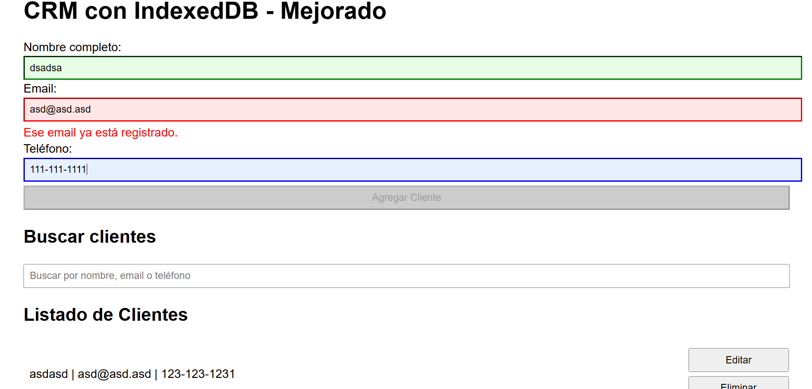

# Proyecto CRM con IndexedDB - Mejoras y funcionalidades extra

Este proyecto es una aplicación web sencilla para la gestión de clientes (CRM) que utiliza **IndexedDB** como base de datos local en el navegador. El código está organizado y documentado para facilitar su mantenimiento y revisar las mejoras implementadas.

##  Mejoras implementadas sobre el código original

### 1. Búsqueda y filtrado instantáneo
- Se añadió una barra de búsqueda para que el usuario pueda filtrar clientes por nombre, email o teléfono en tiempo real.
- La lista responde a cada letra que se escribe, facilitando la localización de datos incluso en bases grandes.

### 2. Validación avanzada de email único
- El formulario ahora verifica si el email ya existe entre los clientes registrados mientras se escribe.
- Si el email está en uso, el input se marca en rojo y aparece un mensaje de error. El botón para guardar se desactiva, evitando duplicidad y mejorando la calidad de los datos.

### 3. Animaciones de interfaz de usuario
- Al agregar y eliminar clientes en la lista, se muestran animaciones suaves (`fadeIn`, `fadeOut`) que mejoran la experiencia visual y el feedback del sistema.

##  Cómo usar

1. Escribe nombre, email y teléfono en el formulario. El botón “Agregar Cliente” solo se habilita si todo es válido y el email no está repetido.
2. Busca cualquier cliente usando la barra de búsqueda.
3. Edita y elimina clientes fácilmente; la lista se actualiza con animaciones.

##  Estructura del proyecto

- `index.html`: Maquetación y estructura de la interfaz.
- `js/crm-indexeddb.js`: Lógica de negocio, gestión de evento y base de datos. Bien comentado y con variables descriptivas.
- `README.md`: Explicaciones funcionales, estructura y cambios aplicados.

##  Recomendaciones para revisión

- Ejecuta `index.html` en cualquier navegador moderno.
- No requiere servidor ni dependencias externas.
- El código incluye comentarios y variables descriptivas para facilitar su lectura.
- Para cualquier duda, revisa los comentarios en el JS o contacta al autor.

##  Ejemplo visual

> *Ejemplo de interfaz: búsqueda activa y validaciones avanzadas*

---
